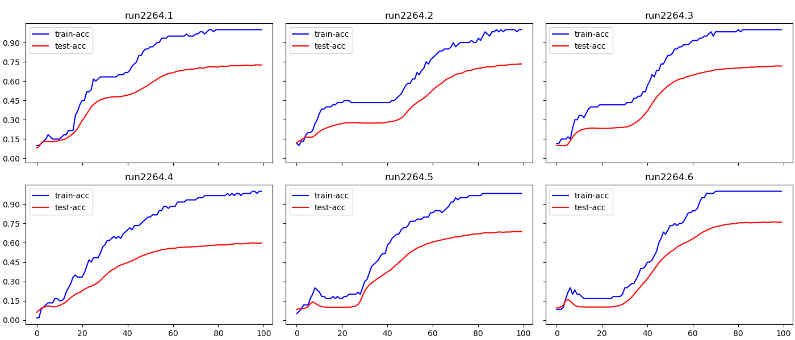

.. _plot:  

========================================
plot command
========================================

Usage::

    xt plot <runs> [col-list] [OPTIONS]

Description::

        plot the logged metrics for specified runs in a matrix of plots

Arguments::

  runs        a comma separated list of runs, jobs, or experiments
  col-list    a comma separated list of metric names to plot

Options::

  --aggregate           str               how to aggregate data from multiple runs into a single plot [one of: none, mean, min, max, std, var, sem]
  --break-on            str_list          the entity that triggers a plot change: usually 'run' or 'col' or 'group'
  --color-map           str               the name of a matplotlib color map to use for trace colors
  --color-steps         int               the number of steps in the color map
  --colors              str_list          the colors to cycle thru for each trace in a plot
  --error-bars          str               value to use for error bars [one of: none, std, var, sem]
  --group-by            str               the column to group data by (for --aggregate option)  [one of: run, node, job, experiment, workspace]
  --layout              str               specifies how the plots should be layed out, e.g., '2x3'
  --legend-args         named_arg_list    a list of name=value arguments to pass to the matplotlib legend object
  --legend-titles       str_list          the titles to show in the legends of each plot
  --max-runs            int               the maximum number of runs to plot
  --max-traces          int               the maximum number of plot traces to draw
  --plot-args           named_arg_list    a list of name=value arguments to pass to the matplotlib plot object
  --plot-titles         str_list          the titles to display on the plots
  --save-to             str               path to file to which the plot will be saved
  --shadow-alpha        float             the alpha blending factor used to draw the plot shadow 
  --shadow-type         str               the type of plot shadow to draw [one of: none, pre-smooth, min-max, std, var, sem]
  --show-legend         flag              controls if the legend is shown
  --show-plot           flag              specifies if plot should be displayed
  --show-toolbar        flag              controls if the matplotlib toolbar is shown
  --smoothing-factor    float             the smoothing factor to apply to values before plotting (0.0-1.0)
  --style               str               the seaborn plot style to use [one of: darkgrid, whitegrid, dark, white, ticks, none]
  --timeout             float             the maximum number of seconds the window will be held open
  --title               str               the title to use for the set of plots
  --workspace           str               the workspace for the runs to be displayed
  --x                   str               the metric to use for plotting along the x axis
  --x-label             str               the label to display on the x axis

Examples:

  plot the specified metrics for the specified runs, with a new plot for each run, in a 2x3 grid of plots::

  > xt plot run2264.1-run2264.6  train-acc, test-acc --break=run --layout=2x3

.. seealso:: 

    - :ref:`XT Plotting <plotting>`
